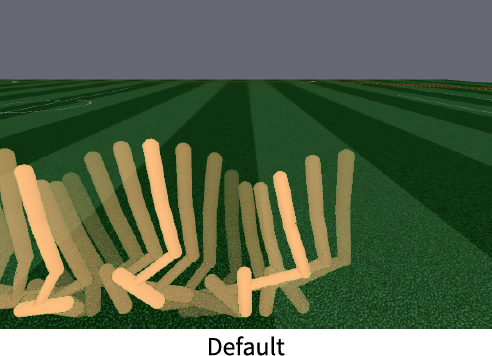
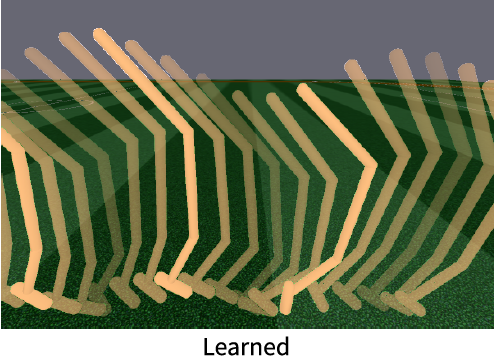
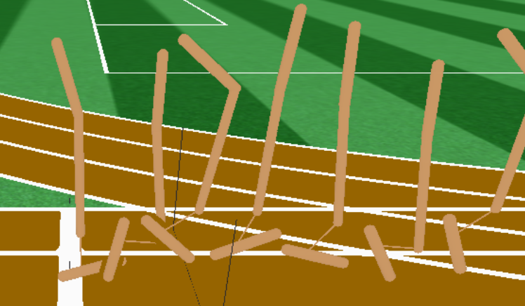

## Reproducing: Jointly Learning to Construct and Control Agents Using Deep Reinforcement Learning
Haowen Ge, Zizhao Wang & Yetong Zhang

This project tries to reproduce the results in the paper "Jointly Learning to Construct and Control Agents Using Deep Reinforcement Learning" (https://arxiv.org/abs/1801.01432). 

The algorithm  aims at maximizing reward by jointly optimizing over the physical design and the corresponding control policy of a robot. It models the control policy as neural network and design parameters as Gaussian Mixture Model, and it iteratively improves them using Proximal Policy Optimization and Parameter-exploring Gradient respectively.

We reproduced the results with the Hopper in the RoboSchool environment, and we gained similar result with the original paper in terms of the physical design of the robot: longer and thinner torso and leg.

  
   
   

Figure 1: Visualization of physical design and corresponding learned gaits for default and learned
robots. Left: the default Hopper design. Middle: learned robot in the original paper. Right: our learned robot

The following is a gif showing our learned robot:

  

